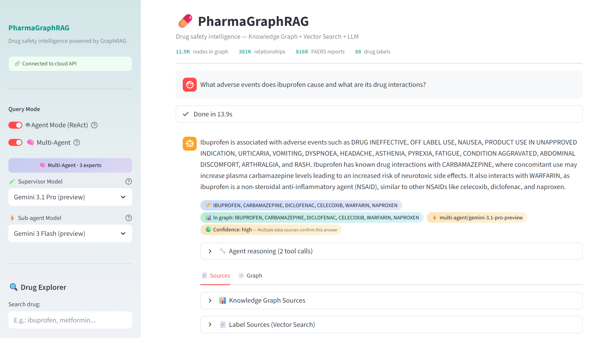
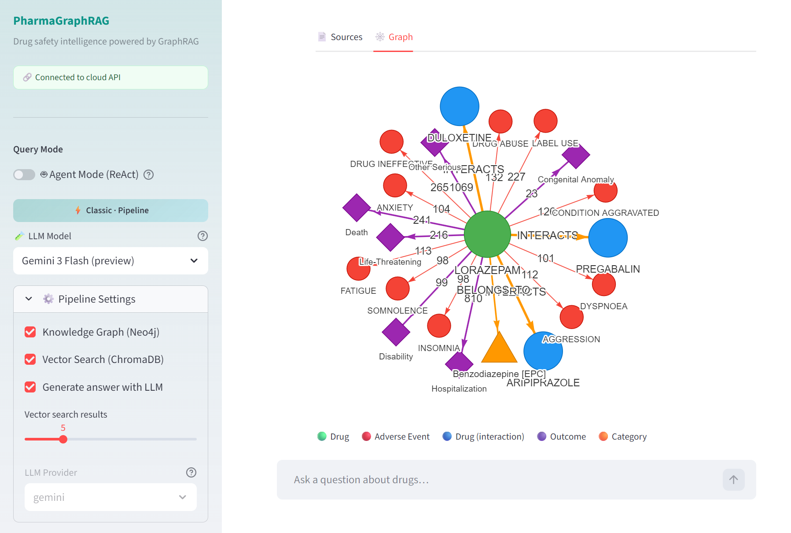
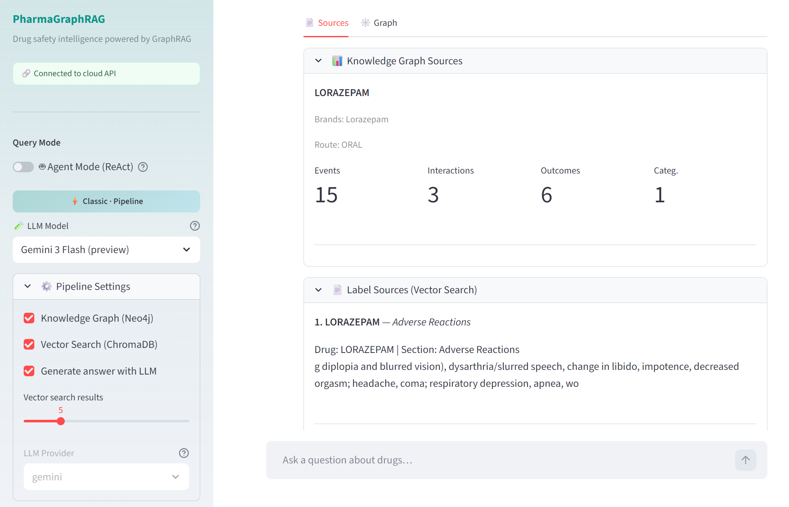
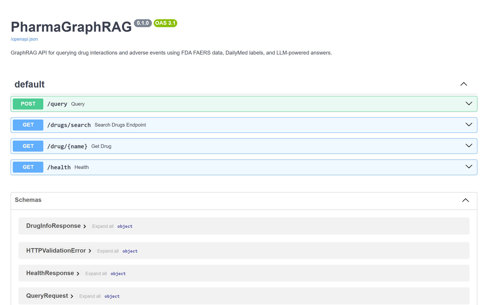
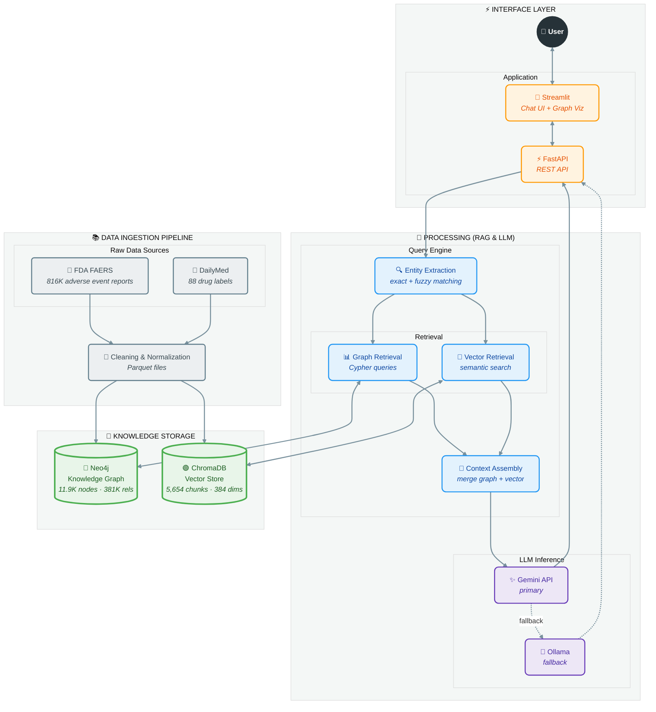

# PharmaGraphRAG

[](https://github.com/jmponcebe/PharmaGraphRAG/actions/workflows/ci.yml)
[](https://github.com/jmponcebe/PharmaGraphRAG/actions/workflows/deploy.yml)
[](https://www.python.org/downloads/)
[](#testing)
[](https://docs.astral.sh/ruff/)
[](LICENSE)
[](https://pharmagraphrag.streamlit.app)
[](https://codespaces.new/jmponcebe/PharmaGraphRAG?quickstart=1)

> **GraphRAG system for querying drug interactions and adverse events using FDA data.**

A production-ready question-answering system that combines a **pharmaceutical knowledge graph** (Neo4j) with **Retrieval-Augmented Generation** (RAG) to answer natural language questions about drug interactions and adverse events — grounded in real **FDA FAERS** data and **DailyMed** drug labels.

---

## Table of Contents

- [Screenshots](#screenshots)
- [Key Highlights](#key-highlights)
- [Architecture](#architecture)
- [Tech Stack](#tech-stack)
- [Quick Start](#quick-start)
- [Cloud Deployment](#cloud-deployment)
- [Development](#development)
- [Knowledge Graph Schema](#knowledge-graph-schema)

---

## Screenshots

**💬 Chat Interface — Multi-Agent Mode with Model Selector**



<table>
<tr>
<td width="33%">

**🔗 Graph Visualization**



</td>
<td width="33%">

**📊 Source Evidence**



</td>
<td width="33%">

**⚡ FastAPI Swagger**



</td>
</tr>
</table>

### Key Highlights

- **Dual retrieval**: structured graph queries (Neo4j) + semantic vector search (ChromaDB) merged into a single LLM prompt
- **Agent Mode**: LangGraph ReAct agent that autonomously decides which tools to call (9 tools: drug info, adverse events, interactions, labels, drug search, event search, outcomes, comparison, categories) based on the question. Includes conversation memory, structured output (confidence + follow-ups), multi-agent supervisor with 3 specialized experts, per-query model selector (Flash for agents, Pro for supervisor), response caching and graceful fallback to classic pipeline
- **Transparent UI**: clickable follow-up suggestions, confidence level tooltips, pipeline steps expander (classic mode), nested sub-agent reasoning hierarchy (multi-agent mode)
- **Real FDA data**: 816K adverse event reports, 4,998 drugs, 365K causal relationships, 88 drug labels
- **261 tests** with CI/CD on GitHub Actions (Python 3.11 + 3.13 matrix)
- **Full stack**: data pipeline → knowledge graph → vector store → query engine → REST API → chat UI
- **One-click Codespaces**: try it instantly from your browser

### Example Questions

> *"What are the side effects of ibuprofen?"* · *"Does metformin interact with other drugs?"* · *"Compare the safety profiles of aspirin and clopidogrel"* · *"What drugs cause liver damage?"*

<details>
<summary><strong>Component Status</strong> — all modules complete, 261 tests passing</summary>

| Component | Status | Details |
| --- | --- | --- |
| Data Pipeline | ✅ Complete | FAERS (2024Q3+Q4): 816K reports, 3.9M drug entries. DailyMed: 88 drugs |
| Knowledge Graph | ✅ Complete | 4,998 Drugs, 6,863 AdverseEvents, 365K CAUSES, 193 INTERACTS_WITH |
| Vector Store | ✅ Complete | 5,654 text chunks, 384-dim embeddings, cosine similarity search |
| Query Engine | ✅ Complete | Entity extraction (exact + fuzzy), dual retrieval, prompt assembly |
| LLM Integration | ✅ Complete | Gemini API + Ollama with automatic fallback |
| REST API | ✅ Complete | FastAPI: POST /query, POST /agent/query, POST /agent/multi, GET /drug/{name}, GET /health |
| Chat UI | ✅ Complete | Streamlit: chat, graph visualization, sources panel, drug explorer, clickable follow-ups, confidence tooltips, pipeline steps |
| Docker Compose | ✅ Complete | Neo4j + API + UI + Ollama (optional profile) |
| CI/CD | ✅ Complete | GitHub Actions: lint, test matrix (3.11/3.13), Docker build |
| Agent Mode | ✅ Complete | LangGraph ReAct agent with 9 tools, conversation memory, structured output, multi-agent supervisor, nested reasoning |
| Evaluation | ✅ Complete | RAGAS 0.4.3 (Faithfulness, Relevancy, Precision, Recall, Correctness) + agent tool accuracy (P/R/F1) |
| Tests | ✅ 261 passing | Data (29) + vectors (35) + engine (37) + LLM (14) + API (18) + UI (14) + agent (61) + observability (13) + evaluation (40) |

</details>

## Architecture

> The diagram below shows the **Classic Mode** pipeline. In Agent and Multi-Agent modes, the Query Engine is replaced by a LangGraph ReAct agent that autonomously selects tools from the same knowledge storage layer.



### Query Flow

1. **Entity extraction** — Identifies drug names using exact substring matching (word-boundary aware) + fuzzy matching (rapidfuzz, threshold=80)
2. **Graph retrieval** — Queries Neo4j for adverse events, interactions, outcomes, and categories per drug
3. **Vector retrieval** — Searches ChromaDB for relevant drug label text chunks (per-drug + global)
4. **Context assembly** — Merges graph + vector context into a structured LLM prompt
5. **LLM generation** — Sends to Gemini API (or Ollama fallback) with pharmaceutical system prompt
6. **Response** — Returns answer + sources/evidence for transparency

### Agent Mode (ReAct)

In Agent Mode, the LLM autonomously decides which tools to call:

1. **Reasoning** — The agent analyzes the question and selects tools
2. **Tool execution** — Calls graph/vector services (9 tools: drug info, adverse events, interactions, labels, drug search, event search, outcomes, comparison, categories)
3. **Iteration** — May call multiple tools in sequence, refining results. Conversation memory persists across questions
4. **Structured output** — Returns answer with confidence level (high/medium/low), drugs and adverse events mentioned, and follow-up suggestions
5. **Multi-agent mode** — Optional supervisor delegates to 3 specialized sub-agents (Drug Expert, Safety Analyst, Literature Researcher). Dual model selector: Pro models for supervisor reasoning, Flash models for sub-agents
6. **Fallback** — If rate-limited, auto-falls back to classic pipeline; if LLM fails entirely, returns raw graph/vector data

## Tech Stack

| Component | Technology |
| --- | --- |
| Language | Python 3.13 (compatible 3.11+) |
| Package Manager | [uv](https://docs.astral.sh/uv/) (Rust-based, fast) |
| Knowledge Graph | Neo4j 5 Community (Docker) |
| Vector Store | ChromaDB (embedded, SQLite-backed) |
| Embeddings | sentence-transformers (all-MiniLM-L6-v2, 384 dims) |
| LLM Primary | Google Gemini API (configurable per query: Flash / Pro models) |
| LLM Backup | Ollama + Llama 3 / Mistral (local) |
| Agent Framework | [LangGraph](https://langchain-ai.github.io/langgraph/) + [LangChain](https://python.langchain.com/) (ReAct agent) |
| Observability | [Langfuse](https://langfuse.com/) (LLM tracing, token tracking, latency monitoring) |
| NLP | rapidfuzz (fuzzy entity matching) |
| API | FastAPI + Pydantic v2 |
| UI | Streamlit + streamlit-agraph (graph visualization) |
| Containers | Docker Compose (multi-stage, non-root, healthchecks) |
| CI/CD | GitHub Actions (CI: lint + test matrix; CD: v* tags → Cloud Build → Cloud Run) |
| Testing | pytest (261 tests, mocked services) |
| Linting | ruff (check + format) |

## Data Sources

| Source | Content | Scale |
| --- | --- | --- |
| [FDA FAERS](https://fis.fda.gov/extensions/FPD-QDE-FAERS/FPD-QDE-FAERS.html) | Adverse event reports (drugs, reactions, outcomes) | 816K reports, 2 quarters |
| [DailyMed](https://dailymed.nlm.nih.gov/dailymed/) | Drug labels (interactions, warnings, contraindications) | 88 drugs, 12 label sections |

## Quick Start

### Option 1: Try It Now

**👉 [pharmagraphrag.streamlit.app](https://pharmagraphrag.streamlit.app)**

The production deployment serves the complete dataset (816K reports, 88 drug labels, 5,654 embeddings) — no installation required.

### Option 2: GitHub Codespaces

Open a fully configured cloud environment in your browser — everything installs and starts automatically:

[](https://codespaces.new/jmponcebe/PharmaGraphRAG?quickstart=1)

Dependencies install, Neo4j loads demo data (~3 min), and the Streamlit UI opens automatically.

> For best results, set `GEMINI_API_KEY` in `.env` ([get one here](https://aistudio.google.com/apikey)). Without it, the system falls back to Ollama.

### Option 3: Run Locally

<details>
<summary>📋 Click to expand setup instructions</summary>

```bash
# Clone and install
git clone https://github.com/jmponcebe/PharmaGraphRAG.git
cd PharmaGraphRAG
uv sync --extra dev

# Configure
cp .env.example .env
# Optional: set GEMINI_API_KEY in .env (free: https://aistudio.google.com/apikey)

# Start Neo4j + load demo data
docker compose up -d neo4j
uv run python scripts/setup_demo.py   # ~3 min: loads graph + embeddings

# Start the app
uv run uvicorn pharmagraphrag.api.main:app --host 0.0.0.0 &
uv run streamlit run src/pharmagraphrag/ui/app.py
```

Demo includes 88 drugs with adverse events, interactions, and full label embeddings.

</details>

### Option 4: Build from Source

<details>
<summary>📋 Click to expand full pipeline instructions</summary>

For the complete dataset (816K reports, 4,998 drugs):

#### Prerequisites

- Python 3.11+
- [uv](https://docs.astral.sh/uv/) (recommended) or pip
- Docker and Docker Compose
- Gemini API key ([free](https://aistudio.google.com/apikey)) or Ollama installed locally

#### Installation

```bash
git clone https://github.com/jmponcebe/PharmaGraphRAG.git
cd PharmaGraphRAG
uv sync --extra dev
cp .env.example .env
# Edit .env: set GEMINI_API_KEY, adjust NEO4J_PASSWORD if needed
```

#### Data Pipeline

```bash
docker compose up -d neo4j

uv run python scripts/download_faers.py     # Download FAERS data (~135MB)
uv run python scripts/clean_faers.py         # Clean FAERS → Parquet
uv run python scripts/ingest_dailymed.py     # Fetch DailyMed drug labels
uv run python scripts/load_graph.py          # Load knowledge graph into Neo4j
uv run python scripts/load_vectorstore.py    # Build vector store (ChromaDB)
uv run python scripts/validate_search.py     # Validate semantic search
```

#### Running the Application

```bash
# Option A: Local (development)
uv run uvicorn pharmagraphrag.api.main:app --reload
uv run streamlit run src/pharmagraphrag/ui/app.py

# Option B: Docker Compose (production)
docker compose up --build -d
```

</details>

### API Endpoints

| Method | Endpoint | Description |
| --- | --- | --- |
| `POST` | `/query` | Ask a question → RAG-powered answer with sources |
| `POST` | `/agent/query` | Agent Mode — ReAct agent autonomously selects tools |
| `GET` | `/drug/{name}` | Graph data for a specific drug |
| `GET` | `/drugs/search?q=` | Search drugs by name prefix |
| `GET` | `/health` | Service health check |

Interactive documentation available at [`/docs`](https://pharmagraphrag-api-893694384146.us-central1.run.app/docs) (Swagger UI).

## Cloud Deployment

The project is **deployed and live** on a distributed cloud architecture:

| Service | Platform | URL |
| --- | --- | --- |
| Chat UI | [Streamlit Community Cloud](https://streamlit.io/cloud) | [pharmagraphrag.streamlit.app](https://pharmagraphrag.streamlit.app) |
| API + Vector Store | [Google Cloud Run](https://cloud.google.com/run) | [pharmagraphrag-api-...run.app](https://pharmagraphrag-api-893694384146.us-central1.run.app/health) |
| Knowledge Graph | [Neo4j Aura](https://neo4j.com/cloud/aura-free/) | Managed instance (11.9K nodes, 381K rels) |

<details>
<summary>📋 Reproducing the deployment</summary>

**Neo4j Aura** — Create a free instance at [console.neo4j.io](https://console.neo4j.io), then migrate data:

```bash
uv run python scripts/migrate_neo4j.py \
    --source bolt://localhost:7687 --source-password pharmagraphrag \
    --target neo4j+s://<id>.databases.neo4j.io --target-password <aura-password>
```

**Google Cloud Run** — Build and deploy the API:

```bash
# Option A: Local Docker build
docker build -f docker/Dockerfile.cloudrun -t gcr.io/<project>/pharmagraphrag-api .
docker push gcr.io/<project>/pharmagraphrag-api

# Option B: Cloud Build (no local Docker needed)
gcloud builds submit --config=cloudbuild.yaml .

# Deploy to Cloud Run
gcloud run deploy pharmagraphrag-api --image gcr.io/<project>/pharmagraphrag-api \
    --region us-central1 --allow-unauthenticated \
    --memory 2Gi --cpu 1 --min-instances 0 --max-instances 2 --timeout 300 \
    --set-env-vars NEO4J_URI=...,NEO4J_USER=neo4j,NEO4J_PASSWORD=...,GEMINI_API_KEY=...
```

> **Note**: First request after inactivity takes ~50s (cold start). Subsequent requests ~4-5s.

**Streamlit Community Cloud** — Connect your GitHub repo at [share.streamlit.io](https://share.streamlit.io), set main file to `src/pharmagraphrag/ui/app.py`, and add `API_URL` as a secret.

</details>

## Development

### Testing

```bash
uv run pytest               # Run all 261 tests
uv run pytest -v             # Verbose output
uv run pytest tests/test_engine.py  # Specific module
```

### Evaluation (RAGAS)

Automated quality evaluation using [RAGAS](https://docs.ragas.io/) metrics against a curated testset of 25 questions (8 types: drug info, interactions, adverse events, outcomes, categories, comparisons, multi-drug, label search).

```bash
# Evaluate classic pipeline against local API
python scripts/run_evaluation.py --mode classic --api-url http://localhost:8000

# Evaluate all modes (classic + agent + multi)
python scripts/run_evaluation.py --mode all --api-url http://localhost:8000

# Against production
python scripts/run_evaluation.py --mode all --api-url https://pharmagraphrag-api-893694384146.us-central1.run.app
```

**Metrics**: Faithfulness, Answer Relevancy (reference-free) + Context Precision, Context Recall, Answer Correctness (reference-based) + Agent tool selection accuracy (precision/recall/F1).

<details>
<summary>📋 Linting, formatting & type checking</summary>

```bash
uv run ruff check src/ tests/              # Lint
uv run ruff check src/ tests/ --fix        # Auto-fix
uv run ruff format src/ tests/             # Format
uv run mypy src/                           # Type check
```

</details>

### Project Structure

```text
src/pharmagraphrag/
├── config.py               # Pydantic BaseSettings (Neo4j, LLM, ChromaDB, etc.)
├── data/                   # Data download, cleaning, ingestion
│   ├── download_faers.py       # Download FAERS quarterly ZIPs from FDA
│   ├── clean_faers.py          # Clean FAERS CSVs → Parquet (normalize, dedup)
│   └── ingest_dailymed.py      # Fetch drug labels from openFDA API → JSON
├── graph/                  # Neo4j schema, loading, queries
│   ├── schema.py               # Constraints + indexes (4 constraints, 5 indexes)
│   ├── loader.py               # Load FAERS + DailyMed into Neo4j (batch upserts)
│   └── queries.py              # Cypher query functions for retrieval
├── vectorstore/            # Embeddings, ChromaDB operations
│   ├── chunker.py              # Text chunking (1000 chars, 200 overlap)
│   ├── embedder.py             # sentence-transformers (all-MiniLM-L6-v2, 384 dims)
│   └── store.py                # ChromaDB add, search, format_context
├── engine/                 # GraphRAG query engine
│   ├── entity_extractor.py     # Drug name extraction (exact + fuzzy matching)
│   ├── retriever.py            # Dual retrieval (Neo4j graph + ChromaDB vector)
│   └── query_engine.py         # Orchestrator: extract → retrieve → prompt assembly
├── agent/                  # LangGraph ReAct agent
│   ├── tools.py                # 9 LangChain tools wrapping graph/vector services
│   ├── graph.py                # ReAct agent (create_react_agent + Gemini + MemorySaver)
│   └── multi.py                # Multi-agent supervisor with 3 specialized sub-agents
├── llm/                    # LLM integration
│   └── client.py               # Unified client: Gemini + Ollama with fallback
├── api/                    # REST API
│   ├── main.py                 # FastAPI app (POST /query, POST /agent/query, POST /agent/multi, GET /drug, GET /health)
│   └── models.py               # Pydantic v2 request/response schemas
├── evaluation/             # RAGAS evaluation framework
│   ├── metrics.py              # RAGAS metric wrappers (Faithfulness, Relevancy, Precision, Recall, Correctness)
│   ├── dataset.py              # Curated testset loader, EvalSample/EvalDataset
│   ├── runner.py               # Batch evaluation runner (calls API, computes RAGAS scores, exports CSV)
│   └── agent_eval.py           # Agent tool selection accuracy (precision/recall/F1)
└── ui/                     # Chat interface
    ├── app.py                  # Streamlit app (chat, sidebar, settings)
    └── components.py           # Graph visualization, sources panel, drug explorer
```

## Knowledge Graph Schema

<details>
<summary>📋 Nodes, relationships, and statistics</summary>

```cypher
(:Drug)-[:CAUSES {report_count}]->(:AdverseEvent)
(:Drug)-[:INTERACTS_WITH {source, description}]->(:Drug)
(:Drug)-[:HAS_OUTCOME {report_count}]->(:Outcome)
(:Drug)-[:BELONGS_TO]->(:DrugCategory)
```

| Node | Count | Source |
| --- | --- | --- |
| Drug | 4,998 | FAERS + DailyMed |
| AdverseEvent | 6,863 | FAERS |
| Outcome | 7 | FAERS (Death, Hospitalization, etc.) |
| DrugCategory | 32 | DailyMed |

| Relationship | Count |
| --- | --- |
| CAUSES | 365,360 |
| HAS_OUTCOME | 15,759 |
| INTERACTS_WITH | 193 |
| BELONGS_TO | 47 |

</details>

---

> **⚠️ Disclaimer**: This project is for **educational and portfolio purposes only**. It is not intended for clinical decision-making.

## License

MIT

## Author

**Jose María Ponce Bernabé** — [GitHub](https://github.com/jmponcebe) · [LinkedIn](https://linkedin.com/in/jmponcebe)
